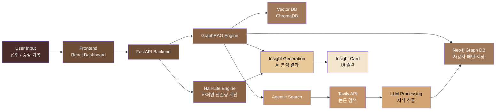

# ☕ Cof/fee v2


> **"오늘 마신 커피가 내일의 두통이 되지 않게."**  
> 카페인 주기 계산기 & 스마트 디톡스 매니저

> 🔒 **이 버전은 안정 버전으로 프리즈된 상태입니다.**  
> 신규 개발은 [Cof/fee v3](https://github.com/hoilycat/Cof-fee-V3)에서 진행됩니다.


---

## 💡 탄생 배경

커피는 죄가 없습니다. 잘못된 섭취 패턴이 고통을 만들 뿐입니다. Cof/fee는 사용자의 **데이터(Graph)** 와 **의학적 지식(Agentic RAG)** 을 연결하여 더 안전한 커피 경험을 설계합니다.

- **핵심 가치:** 양(Quantity) 조절 + 시간(Time) 관리 = 부작용 없는 건강한 커피 생활
- **슬로건:** 카페인, 마시는 시간까지 관리해야 진짜다.
- **핵심 타겟:** 카페인 중독 및 금단 현상(두통, 눈 통증 등) 예방을 원하는 초개인화 케어 사용자

---

## 🧠 System Architecture



---

## ✨ 핵심 기능

### 1. 🧠 Agentic AI 카페인 탐정

- **자가 학습:** AI가 그래프에 없는 새로운 증상을 감지하면 의학 논문을 탐색해 지식을 확장합니다.
- **추론 기반 AI 챗봇:** 섭취 기록과 증상 패턴을 연결해 카페인 인과관계를 설명합니다.

### 2. ⏳ 실시간 잔존량 및 동적 반감기 시뮬레이션

- **반감기 로직:** 체내 카페인 농도를 실시간으로 계산하고 시각화합니다.
- **개인화 변수:** 성별, 체중, 민감도, 생리 모드 같은 대사 변수를 반영합니다.
- **미래 예측:** 음료를 마시기 전 예상 잔존량과 부작용 가능성을 미리 시뮬레이션합니다.

### 3. ☔ 두통 및 금단 예보

- **리바운드 골든타임 알림:** 마지막 섭취 후 12~24시간 뒤 발생하는 금단 위험 시간을 예측합니다.
- **숨은 카페인 추적:** 콜라, 초콜릿, 차처럼 무심코 섭취한 카페인도 함께 관리합니다.

### 4. 🛌 수면 세이프티 가이드

- **수면 신호등:** 카페인 농도에 따라 숙면 가능 여부를 시각화합니다.
- **액션 플랜:** 수분 섭취, 섭취 제한 시간 등 바로 실행할 수 있는 팁을 제공합니다.

---

## 📉 핵심 알고리즘

### 동적 반감기 공식

$$C_{now} = C_{initial} \times 0.5^{\frac{t}{halfLife \times \alpha}}$$

- `$C_{now}$`: 현재 체내 잔존량
- `$C_{initial}$`: 초기 섭취량
- `$t$`: 섭취 후 경과 시간
- `$\alpha$`: 생리 중, 초민감자, 고내성자 등 개인별 대사 가중치

### Agentic GraphRAG Workflow

1. **Context Check:** Neo4j에서 사용자 섭취 및 증상 패턴 스캔
2. **Missing Knowledge Alert:** 미상의 증상 발견 시 검색 에이전트 활성화
3. **Knowledge Extraction:** 검색된 논문에서 관계 정보를 추출
4. **Graph Update & Answer:** 그래프 업데이트 후 최종 답변 생성

---

## 🛠 기술 스택

### Frontend

- **Framework:** React, TypeScript, Vite
- **Styling:** Tailwind CSS
- **State Management:** Jotai
- **Animation:** Framer Motion
- **Visualization:** Recharts

### Backend / AI Engine

- **Server:** FastAPI, Python
- **Database:** Neo4j, ChromaDB
- **AI Engine:** LangChain, GraphRAG, Tavily API
- **Model:** Google Gemini

---

## 📂 프로젝트 구조

```plaintext
src/
├── assets/           # 콩 캐릭터 상태별 이미지, 3D 아이콘
├── components/       # 공통 UI 컴포넌트
│   ├── Emoji3D/      # 감성적인 3D 에모지 컴포넌트
│   ├── GraphFlow/    # AI 인과관계 추론 시각화 UI
│   └── SymptomModal/ # 컨디션 및 생리 모드 기록 폼
├── hooks/            # 비즈니스 로직 커스텀 훅
├── lib/              # 브랜드 데이터 및 그래프 DB 통신 로직
├── pages/
│   ├── Dashboard/    # 캐릭터 기반 실시간 상태 모니터링
│   ├── Stats/        # 주간 분석 리포트 및 인과관계 추적
│   └── Goals/        # 4주 감량 로드맵
└── App.tsx           # 라우팅 및 테마 관리
```

---

## 🥜 캐릭터 페르소나

- **IDLE (Clean):** 카페인 프리, 최상의 회복 상태
- **GOOD (Focused):** 은은한 에너지가 유지되는 집중 모드
- **WARNING (Over):** 과각성 주의, 수분 섭취가 필요한 단계
- **DANGER (Crash):** 부작용 위험, 수면 및 휴식 권고

---

## 🍗 치킨 지수

커피를 참아 아낀 돈을 실시간으로 계산하여 치킨 마리 수로 환산합니다. 지갑 건강까지 챙기는 동기부여 시스템입니다.

---

## 🚦 Roadmap

- [x] Core UI/UX 개발
- [x] 동적 반감기 엔진
- [x] 섭취 및 증상 기록 시스템
- [x] 4주 감량 로드맵
- [ ] Neo4j 그래프 DB 연동
- [ ] 개인 온톨로지 자동 생성
- [ ] Agentic RAG 파이프라인
- [ ] 원탭 AI 브리핑

---

## 🌌 Credits

Designed & Developed by 용용  
감각적 사고 + 논리적 구조를 사랑하는 디자이너/메이커.
