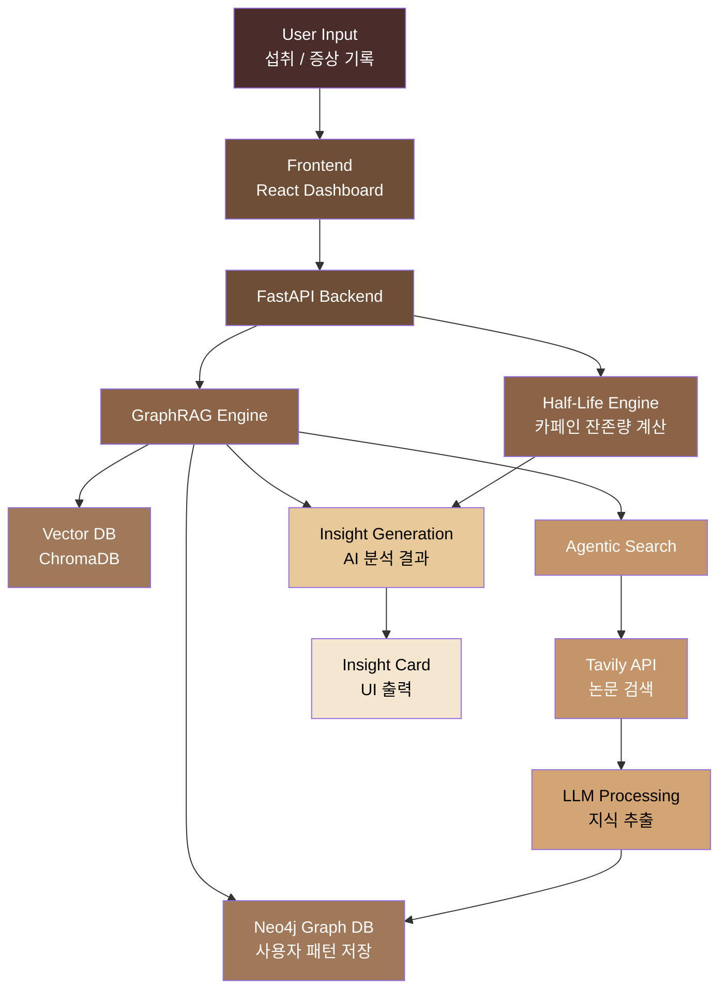

# ☕ Cof/fee v2

> 🔒 **이 버전은 안정 버전으로 프리즈된 상태입니다.**  
> 신규 개발은 [Cof/fee v3](https://github.com/hoilycat/Cof-fee-V3)에서 진행됩니다.


> **"오늘 마신 커피가 내일의 두통이 되지 않게."**  
> 사용자의 과거 패턴을 학습하고, **미지의 증상은 스스로 의학 논문을 탐색해 지식을 확장**하는 **Agentic GraphRAG** 기반 카페인 인과관계 추적 및 AI 코칭 시스템


---

## 💡 탄생 배경
* "커피는 죄가 없습니다. 잘못된 섭취 패턴이 고통을 만들 뿐입니다. Cof/fee는 사용자의 **데이터(Graph)** 와 **의학적 지식(Agentic RAG)** 을 연결하여, 당신에게 가장 완벽한 커피 경험을 설계합니다."

*   **핵심 가치**: 양(Quantity) 조절 + 시간(Time) 관리 = **부작용 없는 건강한 커피 생활**
*   **슬로건**: 카페인, 마시는 시간까지 관리해야 진짜다.
*   **핵심 타겟**: 카페인 중독 및 금단 현상(두통, 눈 통증 등) 예방을 원하는 초개인화 케어 사용자

---

## 🧠 System Architecture
전체 시스템은 다음과 같은 흐름으로 동작합니다.


---


## ✨ 핵심 기능 (Core Features)

### 1. 🧠 Agentic AI 카페인 탐정 (Self-Evolving GraphRAG)
*   **자가 학습 (Agentic Search)**: AI가 그래프에 없는 새로운 증상(예: PMS 기간 가슴 통증)을 감지하면, 스스로 의학 논문 DB를 검색하여 새로운 지식을 추출하고 지식 그래프(Neo4j)를 실시간으로 업데이트합니다.
*   **추론 기반 AI 챗봇**: "왜 오늘 눈이 아프지?"라는 질문에 "방금 의학 논문을 탐색해 본 결과, 어제 마신 콜라의 혈관 확장 리바운드 효과일 확률이 85%입니다"라고 논리적으로 답변합니다.

### 2. ⏳ 실시간 잔존량 및 동적 반감기 시뮬레이션
*   **반감기 로직 적용**: 체내 카페인 농도를 실시간 시각화하며, 성별/체중/민감도 및 **생리 모드(대사 1.5배 저하)** 변수를 반영합니다.
*   **미래 예측 (What-if)**: 음료를 마시기 전, 내일 오전의 예상 잔존량과 부작용 발생 확률을 미리 시뮬레이션합니다.

### 3. ☔ 두통 및 금단 예보 (Headache Forecast)
*   **리바운드 골든타임 알림**: 마지막 섭취 후 12~24시간 뒤 발생하는 금단 증상 위험 시간을 예측하여 선제적으로 대응하게 합니다.
*   **숨은 카페인 추적**: 콜라, 초콜릿, 차 등 무심코 마신 제품 속 카페인이 다음 날 컨디션에 미치는 영향을 추적합니다.

### 4. 🛌 수면 세이프티 가이드 (Sleep Traffic Light)
*   **수면 신호등**: 카페인 농도에 따른 숙면 가능 여부를 시각화(🟢/🟡/🔴)하여 최적의 취침 시간을 제안합니다.
*   **액션 플랜**: "현재 농도에서는 수분 섭취가 배출을 20분 앞당길 수 있습니다"와 같은 실질적 팁을 제공합니다.

---

## 📉 핵심 알고리즘 (Algorithm)

### 1. 동적 반감기 공식 (Dynamic Half-Life)
$$C_{now} = C_{initial} \times 0.5^{\frac{t}{halfLife \times \alpha}}$$
*   **$\alpha$ (가중치)**: 생리 중(1.5), 초민감자(1.2~1.8), 고내성자(0.8) 등 개인별 동적 변수

### 2. Agentic GraphRAG Workflow
1.  **Context Check**: Neo4j에서 사용자 패턴 스캔
2.  **Missing Knowledge Alert**: 미상의 증상 발견 시 웹 검색 에이전트(Tavily API) 활성화
3.  **Knowledge Extraction**: LLM이 검색된 논문에서 트리플(Triplet) 형태의 관계 추출
4.  **Graph Update & Answer**: Neo4j 그래프 업데이트 후 최종 답변 생성

---

## 🛠 기술 스택 (Tech Stack)

### Frontend
- **Framework**: React, TypeScript, Vite
- **Styling**: Tailwind CSS
- **State Management**: Jotai (Atoms & Hooks)
- **Animation**: Framer Motion
- **Visualization**: Recharts

### Backend (AI Engine)
- **Database**: **Neo4j (Knowledge Graph)**, ChromaDB (Vector DB)
- **Server**: FastAPI (Python)
- **AI Engine**: LangChain, **GraphRAG**, **Tavily API (Web Search Agent)**

---

## 📂 프로젝트 구조 (Project Structure)

```plaintext
src/
 ├ assets/           # 콩 캐릭터 상태별 이미지, 3D 아이콘
 ├ components/       # 공통 UI 컴포넌트
 │  ├ Emoji3D/       # 감성적인 3D 에모지 컴포넌트
 │  ├ GraphFlow/     # AI 인과관계 추론 시각화 UI
 │  └ SymptomModal/  # 컨디션 및 생리 모드 기록 폼
 ├ hooks/            # 비즈니스 로직 커스텀 훅 (useCaffeine, useGraphRAG)
 ├ lib/              # 브랜드 데이터 및 그래프 DB 통신 로직
 ├ pages/
 │  ├ Dashboard/     # 캐릭터 기반 실시간 상태 모니터링
 │  ├ Stats/         # 주간 분석 리포트 및 인과관계 추적
 │  └ Goals/         # 4주 감량 로드맵 및 이별 캘린더
 └ App.tsx           # 라우팅 및 테마 관리
```

---

##  🥜 캐릭터 페르소나 (Status 'Been')
* **IDLE (Clean)**: 카페인 프리, 최상의 회복 상태 ☘️
* **GOOD (Focused)**: 은은한 에너지가 유지되는 집중 모드 🔥
* **WARNING (Over)**: 과각성 주의, 수분 섭취가 필요한 단계 ⚠️
* **DANGER (Crash)**: 부작용 위험, 수면 및 휴식 강제 권고 🚨

---

## 🍗 치킨 지수 (Chicken Index)
* 커피를 참아 아낀 돈을 실시간으로 계산하여 '치킨 마리 수'로 환산해 줍니다. 지갑 건강까지 케어하는 스마트한 동기부여 시스템입니다.

---
## 🚦 프로젝트 진척도 (Current Status & Roadmap)

현재 **Phase 1(기반 구축)**을 완료하고, **Phase 2(Agentic AI 엔진 통합)** 단계에 있습니다.

### ✅ Phase 1: Foundation (완료)
- [x] **Core UI/UX 개발**: React + Tailwind 기반의 감성적인 대시보드 및 통계 인터페이스 구축
- [x] **동적 반감기 엔진**: 사용자의 신체 조건 및 민감도를 반영한 실시간 잔존량 계산 로직 구현
- [x] **섭취 & 증상 기록 시스템**: 브랜드별 데이터베이스 연동 및 개인 컨디션 기록 기능
- [x] **4주 감량 로드맵**: 점진적 카페인 감량을 위한 이별 트랙 로직 설계


### 🏗️ Phase 2: Intelligence (진행 중)
- [ ] **Neo4j 그래프 DB 연동**: 사용자의 섭취 이력을 노드와 관계로 변환하는 데이터 파이프라인 구축
- [ ] **개인 온톨로지 자동 생성**: LLM을 활용해 사용자 고유의 부작용 패턴(`콜라` -> `두통`)을 스스로 학습
- [ ] **Agentic RAG 파이프라인**: 미식별 증상 감지 시 AI가 스스로 의학 논문을 웹 검색(Tavily)하여 지식을 자동 확장하는 에이전트 구현
- [ ] **원탭 AI 브리핑 (Insight Card)**: 사용자가 질문을 입력할 필요 없이, AI가 최근 데이터와 웹 검색(논문) 결과를 분석하여 "오늘의 컨디션 인과관계 리포트"를 카드 형태로 자동 생성해 제공합니다.

### 🚀 Phase 3: Advanced Experience (예정)
- [ ] **미래 예측 시뮬레이터**: 음료 섭취 전 내일의 컨디션을 미리 시뮬레이션하는 What-if 기능
- [ ] **인과관계 시각화 UI**: AI가 왜 그런 조언을 했는지 그래프 경로를 통해 보여주는 XAI 기능
- [ ] **스마트 푸시 알림**: 리바운드 발생 예상 시간에 맞춰 선제적으로 발송되는 케어 알림


>>>>>>> 01c27c5144db7f1e253a03d7a7073ecd534f8a06
